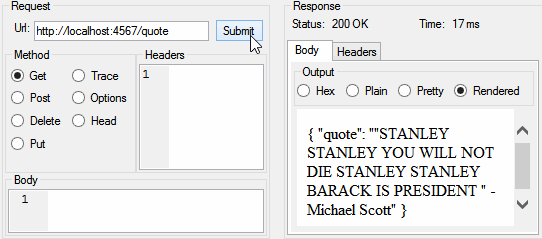

# Michael-Scott-API
[Try it out! https://michael-scott-quotes.herokuapp.com/quote](https://michael-scott-quotes.herokuapp.com/quote)


Just a simple Sinatra REST API server to learn more about Sinatra/Ruby.



Inspired by: https://github.com/jamesseanwright/ron-swanson-quotes

## API

### `GET /quote`
Returns a random quote in this format:
```
{ "quote": ""That's what she said. " - Michael Scott" }
```

## How to run it
```gem install sinatra```

```ruby Driver.rb```

Go to: [http://localhost:4567/quote](http://localhost:4567/quote)
